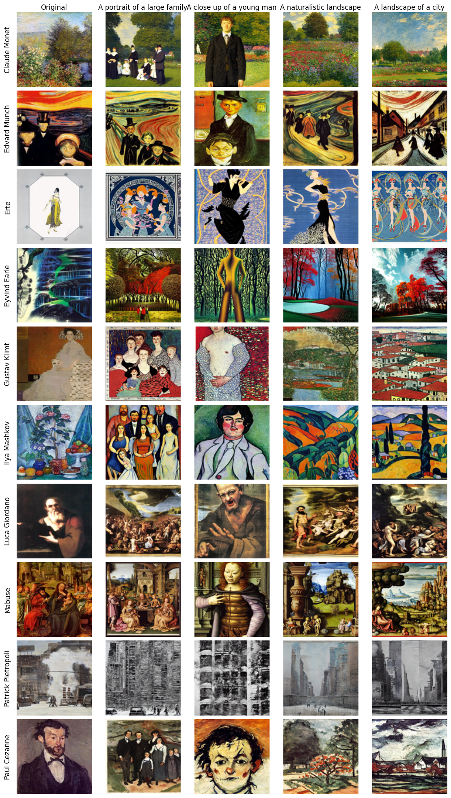

# Textual Inversion per replicare lo stile di artisti

Questo progetto esplora l’efficacia del metodo di **Textual Inversion** nel replicare
lo stile di artisti famosi utilizzando **Stable Diffusion**. Attraverso il fine-tuning su un
dataset di opere d’arte di un modello pre-addestrato, sono state valutate diverse varianti
del metodo, inclusi moduli basati su meccanismi di attenzione ispirati a recenti lavori
e viene presentata una nuova architettura basata su **Mixture of Experts**. I risultati
mostrano che la Textual Inversion migliora significativamente la capacita del modello
di generare immagini coerenti con lo stile di un artista rispetto al semplice Prompt
Engineering, con il modulo Mixture of Experts che ottiene i migliori risultati in termini
di accuratezza.

I risultati vengono valutati visivamente e quantitavimente utilizzando CLIP per calcolare delle
metriche significative (*accuracy* ed *editability*)

# Esempi

